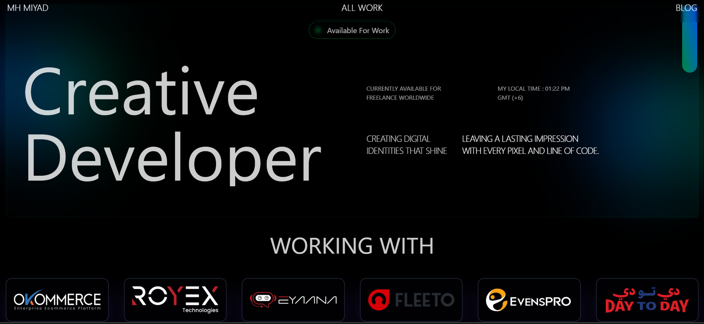

# 👋 Hi, I'm Mahamudul Hasan Miyad

  

<h3 align="center">🚀 Full Stack Developer | MERN Stack Specialist | 3+ Years Experience</h3>
<h4 align="center">Building scalable web applications with modern technologies from Bangladesh 🇧🇩</h4>

  <a href="https://portfolio-miyad.vercel.app/">🌐 Portfolio</a> •
  <a href="mailto:mhmiyad6565@gmail.com">📧 Email</a> •
  <a href="https://linkedin.com/in/mh-miyad">💼 LinkedIn</a> •
  <a href="tel:+8801879042507">📱 +880 187 904 2507</a>

---

## 🎯 About Me

Results-driven **Full Stack Developer** with **3+ years** of experience building user-focused web applications. I specialize in the **MERN stack** and have a passion for creating clean, scalable code that enhances user experience and drives project success.

- 🔭 **Currently working on:** [MOORAN](https://mooran-shop.vercel.app/) - E-commerce platform
- 🌱 **Learning:** React Native, GraphQL, Redux Toolkit, TypeScript
- 👯 **Open to collaborate on:** [EDUVI](https://learning-eduvi.vercel.app/) - Learning platform
- 💬 **Ask me about:** React.js, Node.js, JavaScript (ES6+), MongoDB
- ⚡ **Fun fact:** I think I'm a cool guy who loves turning coffee into code ☕

---

## 💼 Professional Experience

### 🏢 **Front End Developer** @ Royex Technologies
*December 2023 - Present*
- Crafted **15+ responsive web pages**, increasing user engagement by **20%**
- Engineered **10+ custom React components**, reducing page load times by **15%**
- Championed clean, maintainable code, reducing bug reports by **25%**

### 🏢 **MERN Stack Developer** @ Lumen Soft Tech
*July 2022 - November 2023*
- Built scalable SPAs with React and Next.js, improving page load speeds by **20%**
- Designed RESTful APIs with Express.js, reducing server response times by **25%**
- Optimized performance, cutting load times by **30%** and downtime by **15%**

---

## 🏆 Awards & Recognition

🥇 **Creative Front End Developer of the Month** (2023)  
🏆 **Best Employee of the Year** - Lumen Soft Tech (2022)

---

## 🚀 Featured Projects

### 🎯 [CODITALK](https://github.com/mh-miyad/coditalk) | [Live Demo](https://coditalk-live.vercel.app)
*December 2023 - January 2024*

A micro-blogging platform with 200-character limit conversations
- **40% performance boost** using Redux Async-Thunk
- Reduced page load times from **5s to 3s**
- Improved user satisfaction scores by **30%**

**Tech Stack:** React, TypeScript, Next.js, MongoDB, JWT, Mongoose, Firebase, Redux

### 📚 [EDUVI Learning Platform](https://learning-eduvi.vercel.app) | [GitHub](https://github.com/mh-miyad/eduvi)
*January 2025 - Present*

Next-generation e-learning platform with mobile-first design
- **40% increase** in user engagement
- **25% boost** in mobile retention
- **30% faster** load times, increasing course completions by **25%**

**Tech Stack:** React, Vite, Mongoose, Firebase, Zod, MongoDB, JWT, Vercel

### 🛒 [LumeAxis E-commerce](https://lumeaxis-live.vercel.app)
*May 2023 - June 2023*

Modern e-commerce platform with advanced features
- GSAP-powered transitions boosting engagement by **40%**
- SEO-optimized UI reducing load times by **35%** (under 2 seconds)
- Stripe integration improving transaction efficiency by **30%**

**Tech Stack:** Next.js, TypeScript, Shadcn UI, Tailwind CSS, Express.js, Prisma, MongoDB, GSAP, Stripe

---

## 🛠️ Technical Skills

### **Frontend Development**

### **Backend Development**

### **Tools & Cloud**

### **Design & Testing**

---

## 📊 GitHub Statistics

  
  

  

---

## 🏆 GitHub Trophies

  

---

## 📈 Contribution Graph

  

---

## 🎓 Education

**Bachelor of Business Administration (BBA) in Accounting**  
*Green University of Bangladesh* | 2024 - 2028

---

## 🤝 Connect With Me

  

---

## 💭 Quote

> "Clean code always looks like it was written by someone who cares." - Robert C. Martin

---

  
  
  **Thanks for visiting! Let's build something amazing together! 🚀**

